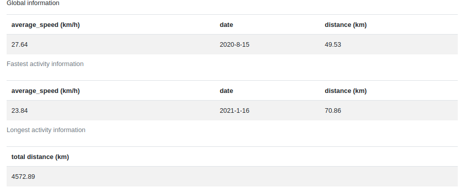
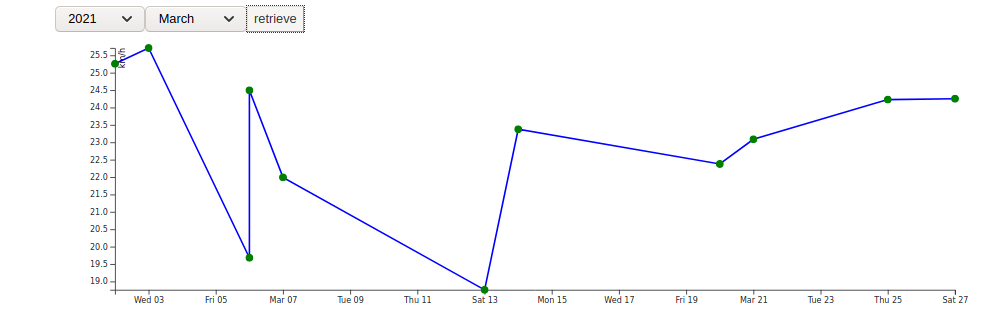
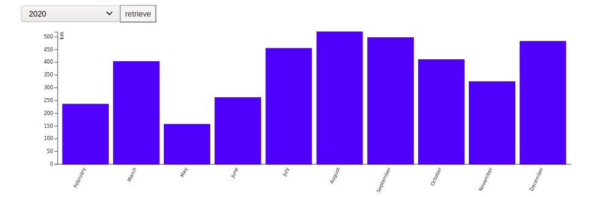
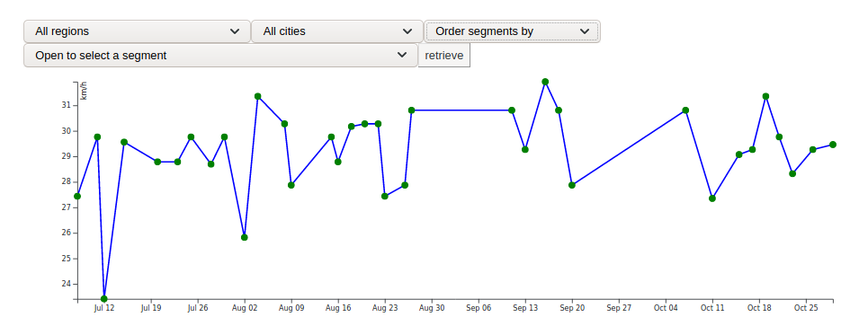

# Calamity Cycling

A Flask application that analyzes your cycling activities from Strava and visualizes them with D3.js.

## Features

- **Fastest activity** — top speed, distance, date
- **Longest activity** — max distance, average speed, date
- **Total distance** — cumulative km across all rides
- **Average speed** — filterable by month and year
- **Monthly distance** — bar chart per year
- **Segment stats** — average speed per activity day for any segment






---

## Prerequisites

- [Docker](https://docs.docker.com/get-docker/) and Docker Compose
- A [Strava account](https://www.strava.com) with an API application created at https://www.strava.com/settings/api

---

## Setup

### 1. Create a Strava API application

Go to https://www.strava.com/settings/api and create an app. Note your **Client ID** and **Client Secret**.

Set the **Authorization Callback Domain** to `localhost`.

---

### 2. Create the `.env` file

Create a file named `.env` at the root of the project:

```env
CLIENT_ID=your_strava_client_id
CLIENT_SECRET=your_strava_client_secret
```

> ⚠️ The `.env` file must end with a newline character.

---

### 3. Start the app

```bash
docker compose up --build
```

Then open your browser at:

```
http://localhost:5000
```

---

## Usage

### Connect Strava

On the home page, click **"Connect with Strava"**. You will be redirected to Strava to authorize the app. After authorizing, you'll be sent back to the app automatically.

### Download your activities

Click the **"Refresh"** button in the top bar. The app will:

1. Fetch all new activities since the last download
2. Store them in MongoDB
3. Fetch detailed data (segments, calories, gear) for each activity
4. Reload the dashboard automatically

Progress logs are printed in the Docker console:

```
[2026-04-24 21:32:00] INFO - === Refresh started ===
[2026-04-24 21:32:00] INFO - Last activity in DB: 2021-11-03 09:14:22
[2026-04-24 21:32:01] INFO - Fetched 12 new activities from Strava
[2026-04-24 21:32:01] INFO - Found 12 activities missing details, fetching...
[2026-04-24 21:32:02] INFO -   [1/12] Fetching details for activity 6142837291
[2026-04-24 21:32:02] INFO -   -> 'Morning Ride' | 42.3 km | 2021-10-01T07:30:00Z
...
[2026-04-24 21:32:15] INFO - === Refresh complete ===
```

---

## Project structure

```
calamity-cycling/
├── app.py               # Flask routes
├── MongoAccess.py       # MongoDB queries
├── StravaAccess.py      # Strava API client
├── Utils.py             # Data transformation helpers
├── templates/
│   └── index.html       # Main UI
├── static/
│   ├── css/
│   └── js/              # D3.js charts
├── docker-compose.yml
├── Dockerfile
└── .env                 # ← you create this
```

---

## TODO

- [ ] Automate token exchange to remove need for manual `.env` setup
- [ ] Show segment detail when clicking a graph point
- [ ] Monthly elevation and burned calories graphs
- [ ] Top 10 segments table (name, distance, grade, number of passes)